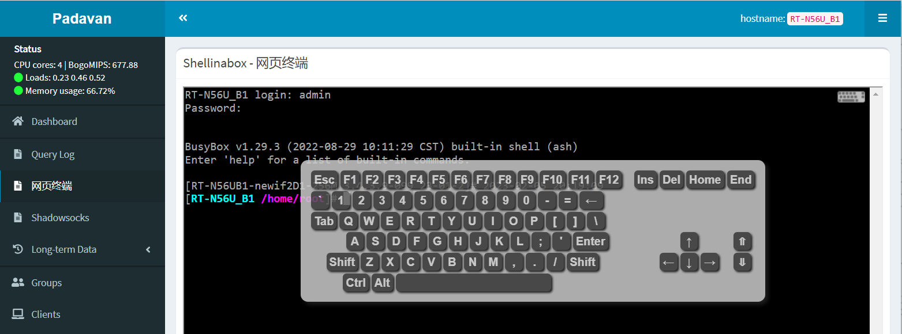
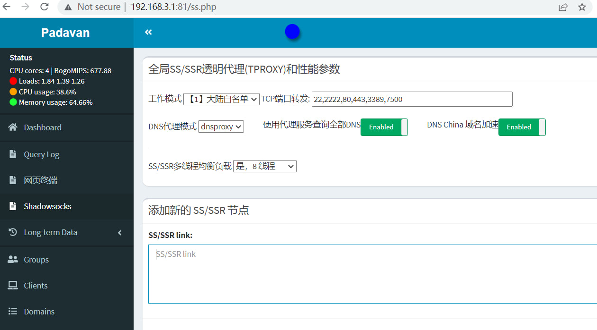
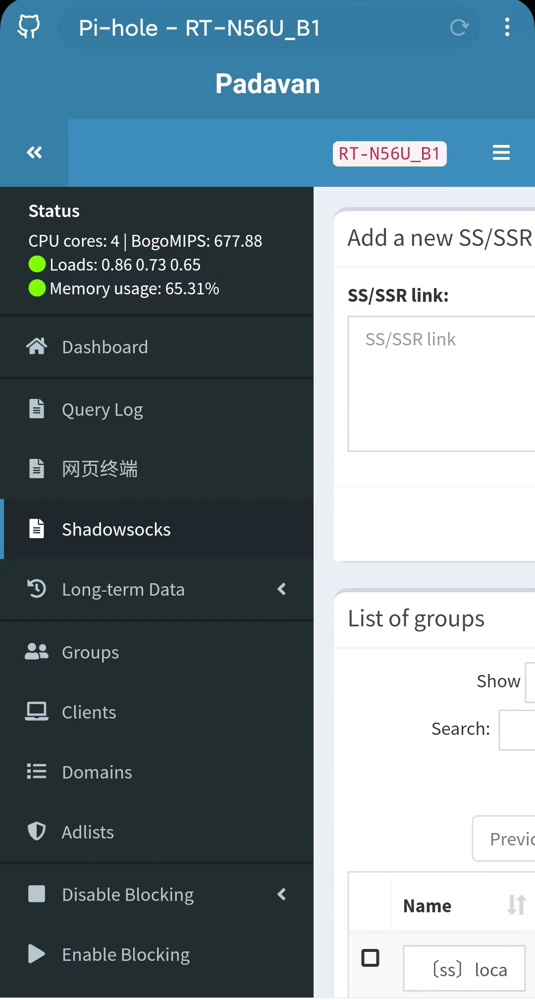

# padavan_admin
A new web interface for Padavan 

It's based on [pi-hole AdminLET](https://github.com/pi-hole/AdminLTE)

## Installation
Download / Extract all files at /etc/storage/ (total 10MB more, please confirm that your firmware has enought space)
Then execute the command :
```
cd /etc/storage && chmod +x setup.sh && ./setup.sh
```

## Desktop UI



## Mobile UI

